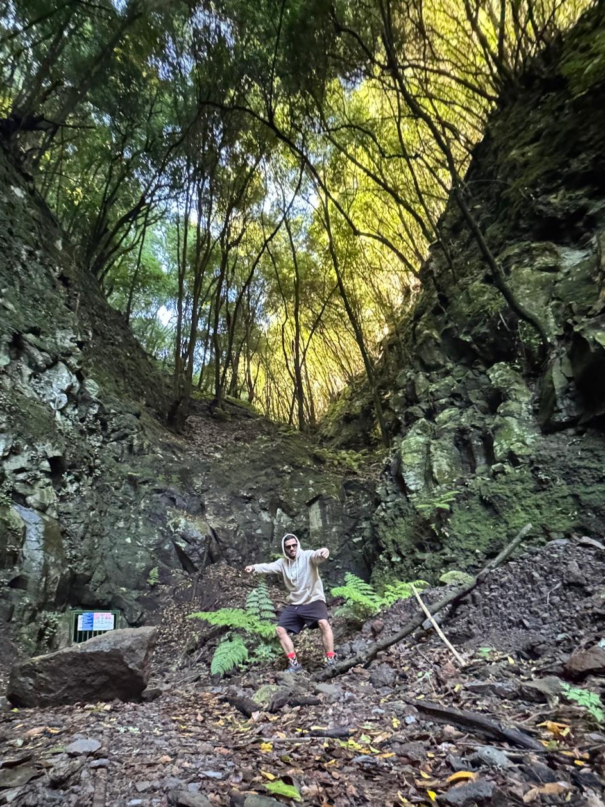

<div style="display: flex; gap: 40px; align-items: flex-start; flex-wrap: wrap;">

<!-- LEFT COLUMN -->
<div style="flex: 1; min-width: 350px; max-width: 350px; text-align: center;">



# Juan Maroñas

Assistant Professor @ CUNEF Universidad

Probabilistic Machine Learning  

---

<div style="display:flex; flex-direction:column; max-width:300px; margin:auto;">

<a href="mailto:juan.maronas@cunef.edu" target="_blank"
style="display:flex; justify-content:space-between; padding:10px 0;
border-bottom:1px solid #eee; text-decoration:none; color:inherit;">
<span>Contact</span>
<i class="fas fa-envelope" style="font-size:32px;"></i>
</a>

<a href="https://github.com/jmaronas" target="_blank"
style="display:flex; justify-content:space-between; padding:10px 0;
border-bottom:1px solid #eee; text-decoration:none; color:inherit;">
<span>GitHub</span>
<i class="fab fa-github" style="font-size:32px;"></i>
</a>

<a href="https://scholar.google.com/citations?user=sGtYXSMAAAAJ&hl=es" target="_blank"
style="display:flex; justify-content:space-between; padding:10px 0;
border-bottom:1px solid #eee; text-decoration:none; color:inherit;">
<span>Research</span>
<i class="fas fa-graduation-cap" style="font-size:32px;"></i>
</a>

<a href="https://www.linkedin.com/in/juan-maronas-molano/" target="_blank"
style="display:flex; justify-content:space-between; padding:10px 0;
text-decoration:none; color:inherit;">
<span>LinkedIn</span>
<i class="fab fa-linkedin" style="font-size:32px;"></i>
</a>

</div>


</div>

<!-- RIGHT COLUMN -->
<div style="flex: 2; min-width: 500px;">

# The JuanBook of Machine Learning

I am Juan Maroñas, an assistant professor at CUNEF Universidad. I am also a member of the Machine Learning Group at Universidad Autónoma de Madrid.

I mostly do research on probabilistic machine learning, including calibration, Bayesian Inference, Gaussian Processes and Deep Neural Networks.

While it depends on the year, I usually teach subjects related to Machine Learning, Deep Learning, Language Technologies and Deep Generative Models at both bachelor and master levels. I also coordinate some of these subjects across different degrees and supervise master and bachelor thesis.

If you are interested in working or collaborating with me please shot and email. I now have space to accomodate both Post Doc and PhD students. If you are a senior researcher and want to collaborate, shot an email as well.

## 📚 What is the JuanBook?

For a long time I used to learn ML, take notes, and code experiments and papers. Everything ended up scattered across uncleaned closed repos or my computer.

This project is my effort to consolidate all that into a clean, structured, and accessible resource.

Why JuanBook? Well just did not want yet another HandBook.

📒 Click here to go to the [JuanBook](book_content/book_index)


## 🎯 Purpose

The purpose of the JuanBook is two fold.

- A place to organize my personal notes and learning
- A teaching resource for machine learning (theory + assessments)

Any inquiry to the JuanBook, which I hope you have, can be send to me via github issues or pull requests through the [repository](https://github.com/jmaronas/Deep-Learning-and-Machine-Learning/)

## ⭐ Disclaimer 

All material is free to use. If you find it useful, consider starring the [repository](https://github.com/jmaronas/Deep-Learning-and-Machine-Learning/)

Why is it free? Well, everything I have learnt is due to the efforts of the open source community. I do not support people which try and make money from academic resources. If you are one of those, you can make money from this material but remember it will always be open to anyone. 

## 🌱 Contributions

If you want to contribute to the JuanBook, with your own material or whatever you want, shot an email or send a pull request. I am always happy to share and use good material from other academics so that we do not have to reinvent the wheel. 

Contributions to the JuanBook are properly acknowledged in the different files.

## 📄 Selected Publications

- *Transforming Gaussian Processes with Normalizing Flows*
  **AISTATS 2021**

- *Efficient transformed Gaussian processes for non-stationary dependent multi-class classification*
  **ICML 2023**

- *Mode Collapse in Variational Deep Gaussian Processes*
  **NeurIPS 2024 Workshop on Bayesian Decision-making and Uncertainty**

- *Towards efficient modeling and inference in multi-dimensional Gaussian process state-space models*
  **ICASSP 2024**

- *The Jacobian and Hessian of the Kullback-Leibler Divergence between Multivariate Gaussian Distributions (Technical Report)*
  **Technical Report in Arxiv, 2025**

</div>

</div>

```{toctree}
:hidden:

book_content/book_index
```
